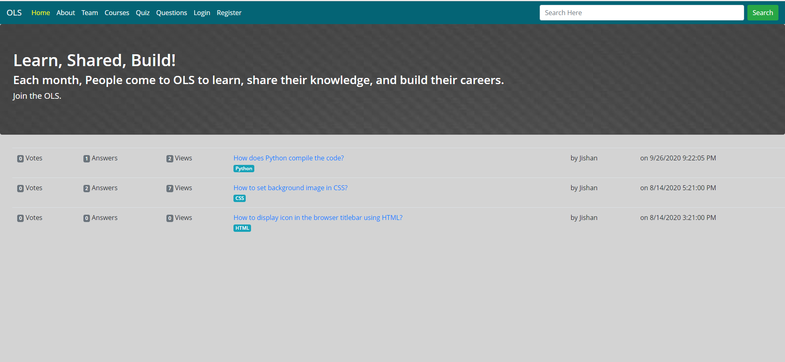
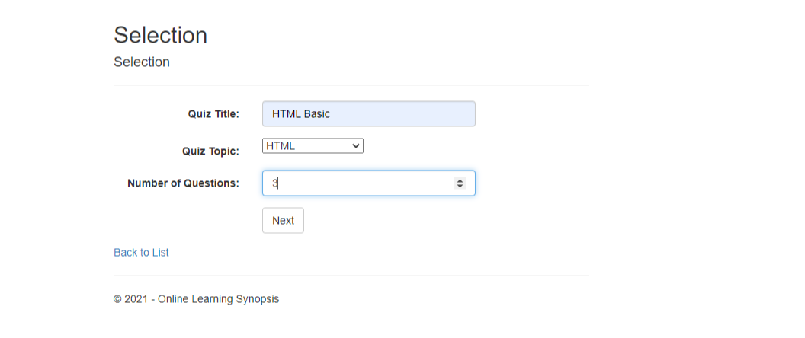
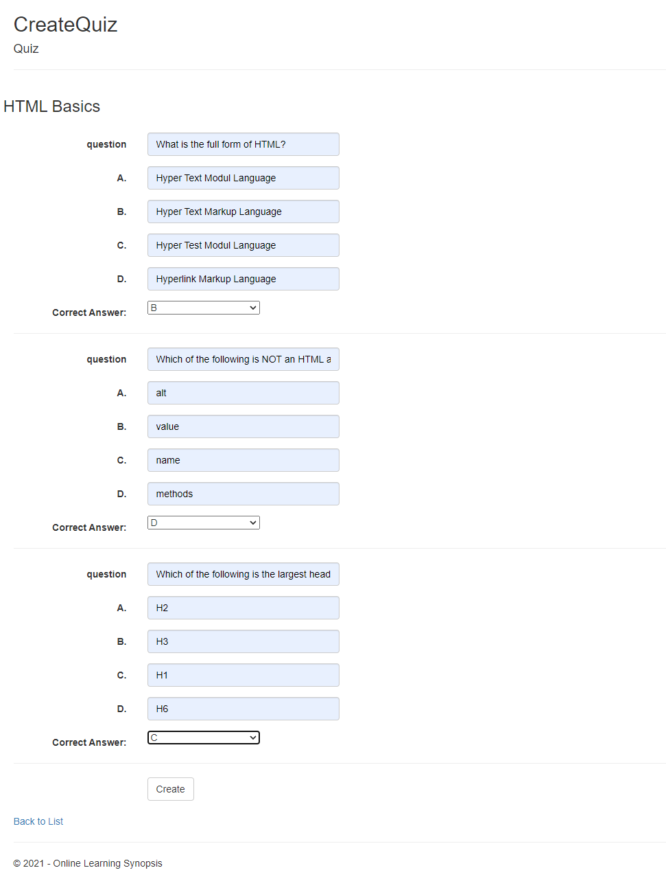
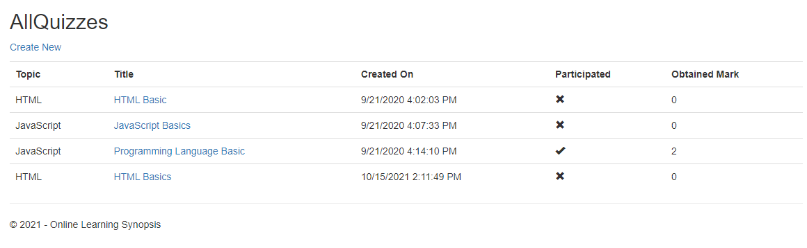
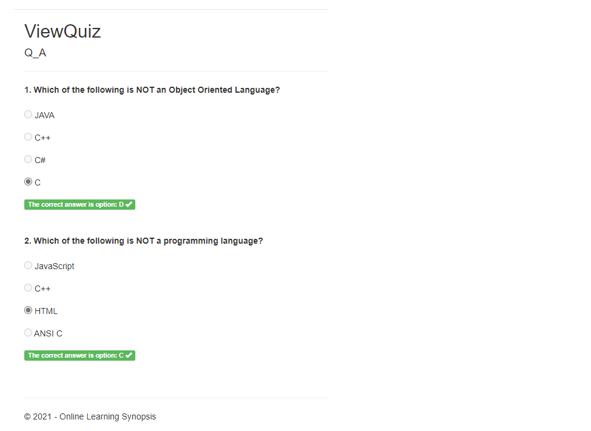
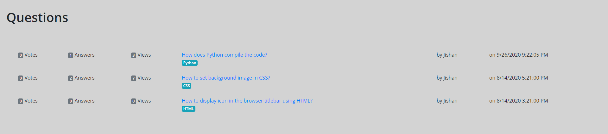

# online-learning-synopsis

A web application designed for learning and attending quizzes on a variety of topics. Also, it contains a discussion platform for discussing the relevant topics.

## Features:
### `1. Quiz System:`
* A registered user can take part in a quiz by filtering out certain topics.
* A registered admin can set up and prepare quiz with whatever multiple choice answers he/she likes.
* A user can get to see the mark obtained in a certain quiz. Also, the user can get to see the correct answers after he/she has completed the quiz.
     
     
### `2. Problem Discussion:`
* Users can post about their problems and questions about certain topics.
* Other users can choose to reply to the questions asked.
* Users can vote for or against the posted replies and thus others can identify the replies with the most "upvotes" as the best answers.

---

### `Screenshots:`

Home Page

---

Admin - Create Quizzes

---

Admin - Set Quiz Questions

---

Users - Attend the Quizzes

---

Users - Review the Attended Quizzes

---

Users - Ask Questions

---

## Contributors   
 ### Anas Mohammad Anwar
   1. Backend program for the Quiz System i.e creating the quizzes and attending them.
   2. Backend program for the Users' Quiz History System.
 ### [Hasnath Jami Chowdhury](https://github.com/HasnathJami)
   1. Responsive UI design for the full project.
   2. Registration System.
   3. Backend program for the Discussion/Problem Sharing (Q/A) System (Categorized), Voting System.